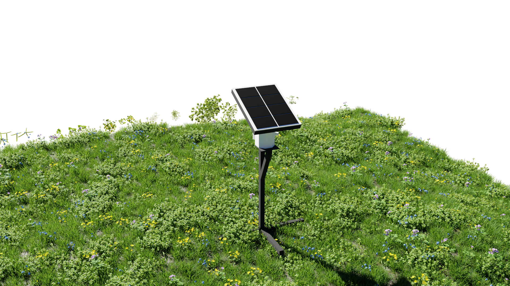

# 🌿 Blender 3D Environment Render  
## PRJ-001  

This repository showcases a 3D environment scene and realistic render created using Blender. The project focuses on outdoor visualization, natural lighting, vegetation detailing, and high-quality rendering techniques for portfolio presentation.

---

## 📌 Project Overview  

This scene features a realistic outdoor environment with emphasis on composition, lighting, and detail. It demonstrates the process of building a visually appealing natural setting using Blender.

### Key Highlights:
- Realistic grass and vegetation setup  
- Outdoor environmental composition  
- High-quality lighting and shadow effects  
- Detailed 3D modeling and scene building  
- Photorealistic rendering workflow  

This project was developed to strengthen skills in:
- 3D modeling in Blender  
- Scene composition and layout  
- Material and texture design  
- Lighting and rendering techniques  
- Environmental visualization workflows  

---

## 🛠️ Software Used  
- Blender  
- Cycles / Eevee Render Engine  

---

## 🎨 Assets & Resources  

Some assets used in this project were sourced from:

- 3D Shaker Models  

All third-party assets remain the property of their respective creators and are used strictly for educational and portfolio purposes.

---

## 📷 Render Preview  

---

## 🚀 Future Improvements  

Planned enhancements for this project include:
- More detailed terrain sculpting  
- Expanded vegetation variety  
- HDRI-based lighting improvements  
- Camera animation and scene walkthroughs  
- Additional environmental detailing  

---

## 📄 License  

This project is intended for educational and portfolio use only.
